<h1>
    Movies Galaxy By ReactJS - Bùi Tấn Phát
</h1>

> **Author**: Bùi Tấn Phát
>
> **Email**: buitanphat2747@thpt-vungtau.edu.vn
>
> **Github**: https://github.com/buitanphat247
>
> **Facebook**: https://www.facebook.com/btanphat

<h2>
    Description
</h2>

<p>
Movie Galaxy is a modern website built on the ReactJS platform, offering users an excellent experience to explore a diverse and rich collection of films. With a user-friendly interface and powerful features, the website not only facilitates easy search for favorite movies but also provides a range of tools to delve deeper into the world of cinema.
</br>
</br>
Each movie on Movie Galaxy is presented clearly and comprehensively, featuring basic information such as title, director, year of release, as well as useful details like genre, release date, and ratings from both users and critics. Users can easily filter movies by various categories such as action, horror, or by highest ratings, release year, and other criteria.
</br>
</br>
The smart search feature allows users to quickly locate movies of interest with just a few search keywords. Users can also explore detailed information about each actor, including their special roles and career journeys, presented in a visual and understandable manner.
</br>
</br>
With the feature to save favorite movies, Movie Galaxy helps users manage a list of movies they want to track and revisit. Whether marking the best movies or those to watch later, users can ensure they never miss any film in their desired list.
</br>
</br>
With its outstanding features and user experience, Movie Galaxy is not just an ideal place to explore the world of cinema but also a reliable companion in every adventure to discover new and exciting films. Experience it now and feel the difference it brings!
</p>
<h2>
    Fearture
</h2>

Movie Galaxy is a web building application on the ReactJS platform, using popular technologies and libraries such as React Router, Axios, Material-UI and Redux to provide users with a great experience during exploration. and interactive exploration with movie information. Below is a detailed description of the main features of Movie Galaxy:

<h5>
1. Search and view detailed information about movies:
</h5>

- **Search for movies:** Users can search for movies by title or genre to easily find their favorite movies.
- **Movie details:** Displays complete information about movies including description, genre, rating, images and trailers.

<h5>
2. Movie filtering and sorting function:
</h5>

- **Filter movies:** Allows users to filter movies by criteria such as genre, product year, or price rating.
- **Movie Sorting:** Supports sorting movie list by alphabetical order, highest price rating or date distribution.

<h5>
3. View information about speakers:
</h5>

- **Actor information:** Provides detailed information about the actors, including biographies, list of films they have participated in and images.

<h5>
4. Watch news about cinema:
</h5>

- **Movie news:** Update the latest news about the movie industry, including information about new movies, events and prominent figures.
<h5>

5. User-friendly and easy-to-use interface:
</h5>

- **Smooth user experience:** Simple and user-friendly interface design, optimized for the best user experience on different devices.
- **Interactive rating and commenting:** Allows users to rate movies and comment to share personal feelings.

<h5>
6. MovieDB API supports:
</h5>

- **Integration with MovieDB API:** Use The Movie Database (TMDb) API to get movie data such as information, images and trailers, helping to update movie information quickly and accurately.
<h2>
    Technology
</h2>
<p>
    Our project utilizes a variety of technologies and libraries to enhance functionality:
</p>

<ol class="ol_list_technology">
    <li>ReactJs</li>
    <li>Tailwind CSS</li>
    <li>React Router</li>
    <li>Toastify</li>
    <li>Slugify</li>
    <li>Circle Progress</li>
    <li>Swiper</li>
    <li>Material UI</li>
    <li>Lodash</li>
    <li>Axios</li>
    <li>React Circular Progressbar</li>
    <li>React DOM</li>
    <li>React Hook Form</li>
    <li>React Loading Skeleton</li>
    <li>React Rating Stars</li>
    <li>Redux Tool Kit</li>
    <li>Styled Components</li>
    <li>Slug</li>
    <li>React Paginate</li>
    <li>React Player</li>
    <li>React Scroll</li>
    <li>React Scrollbars Custom</li>
    <li>React Show More Text</li>
    <li>React Youtube</li>
  </ol>

<p>
    Explore more or contribute in 
    <a href="https://github.com/buitanphat247/Project_Movie_Galaxy_By_React">there.</a>
</p>

<h2>
 Screenshots
</h2>

<ol>
    <li class="li_style_image">Theme Tablet</li>
    <li class="li_style_image">Theme Mobile</li>
    <li class="li_style_image">Theme Laptop</li>
    <div class="image-grid">
    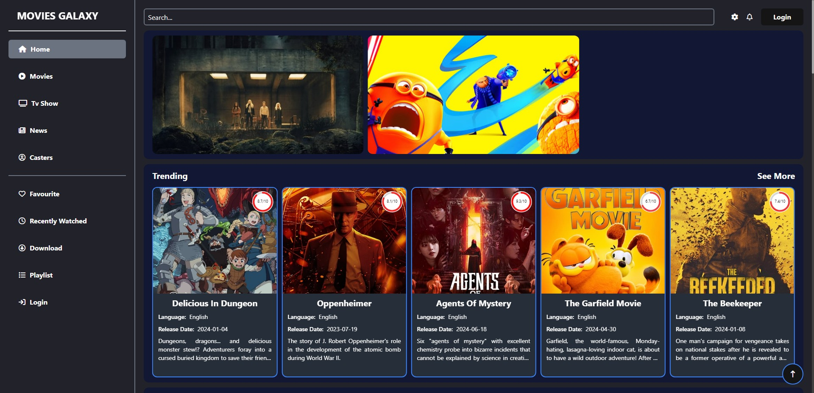
    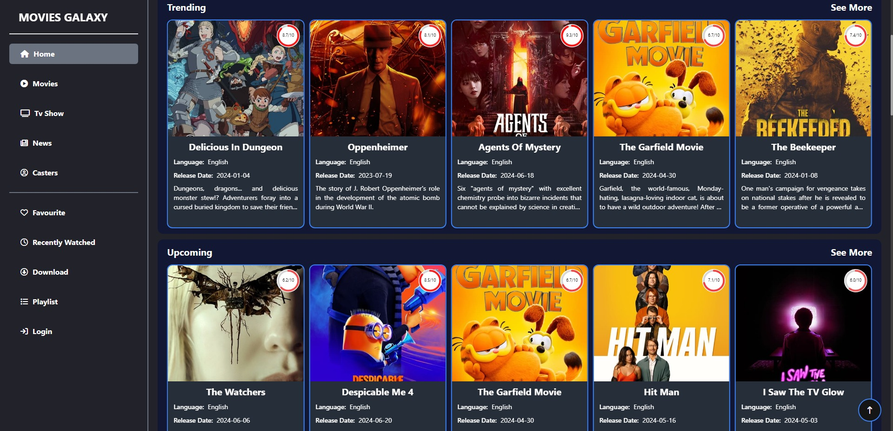
    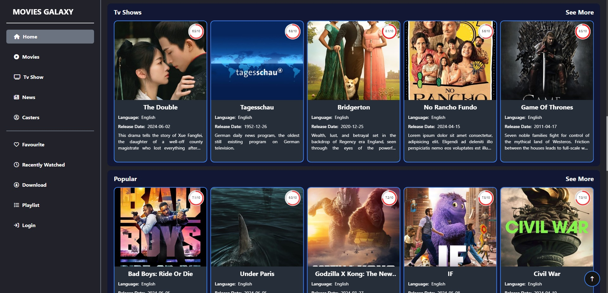
    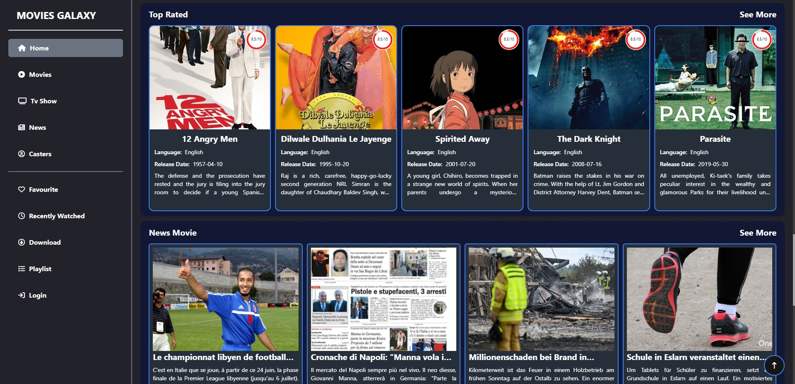
    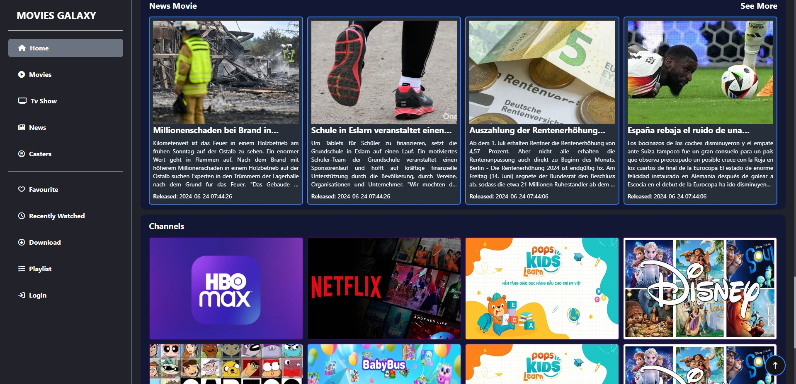
    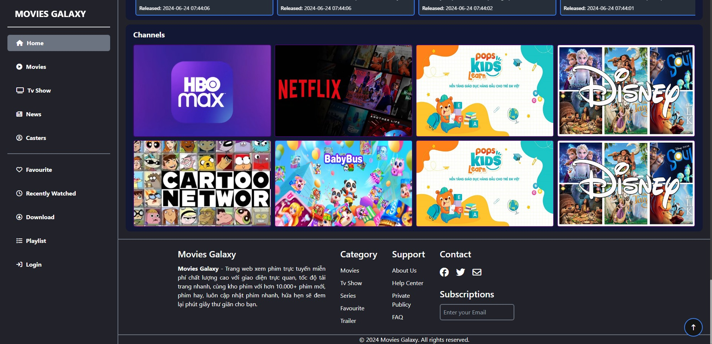
    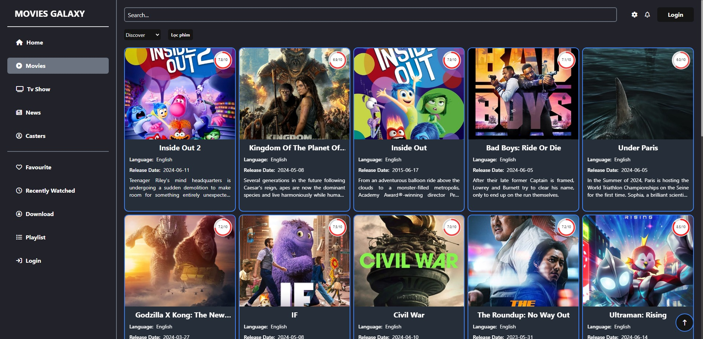
    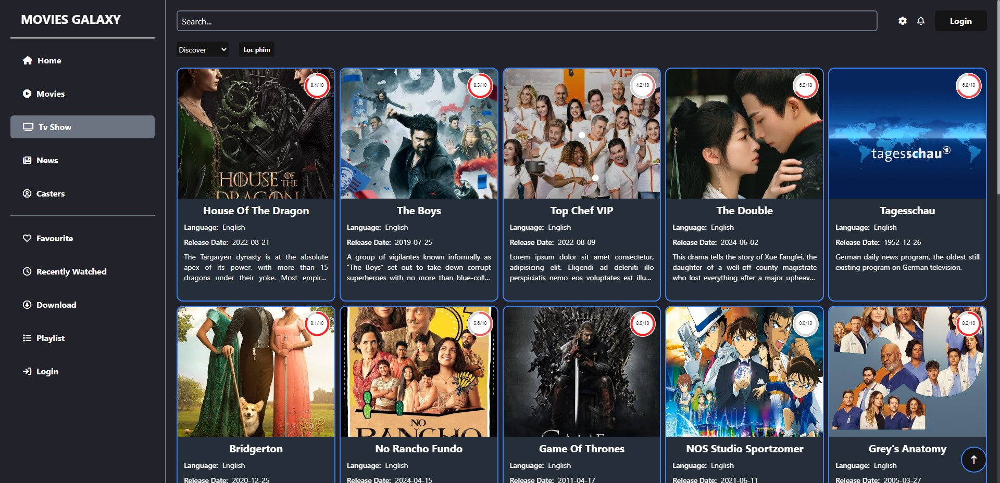
    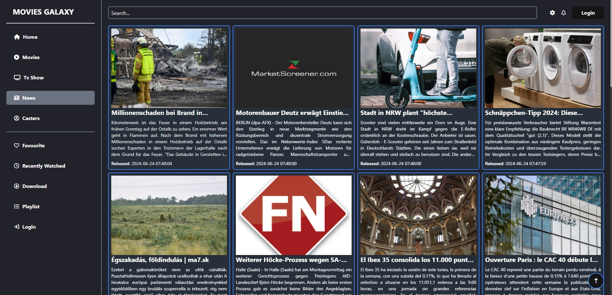
    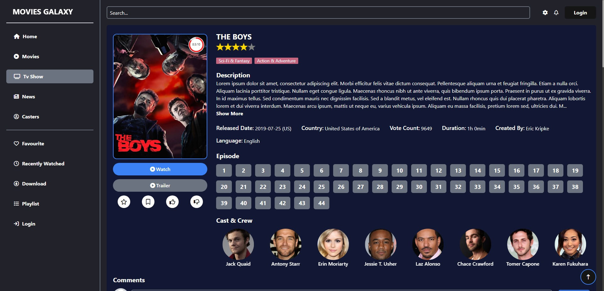
    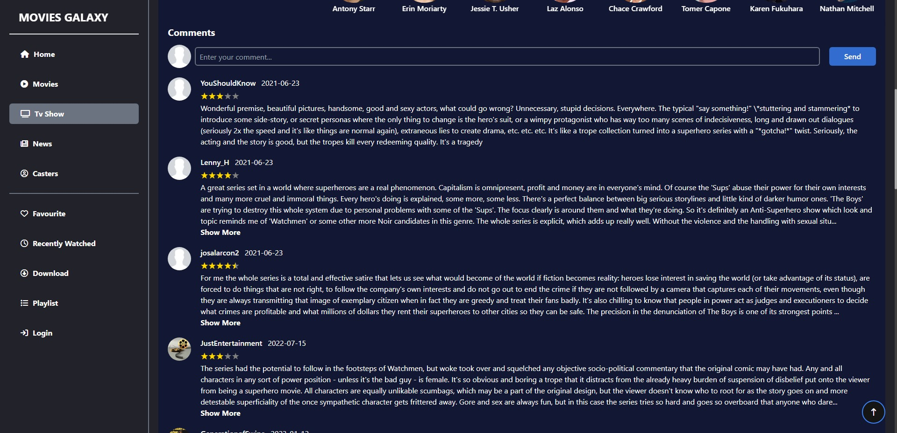
    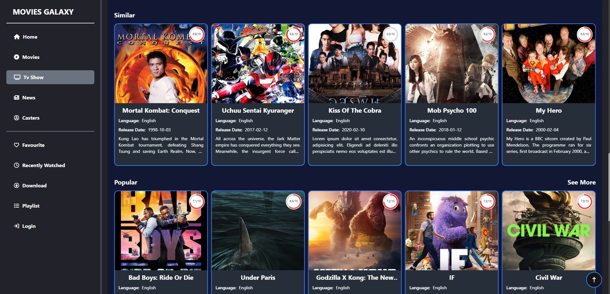
    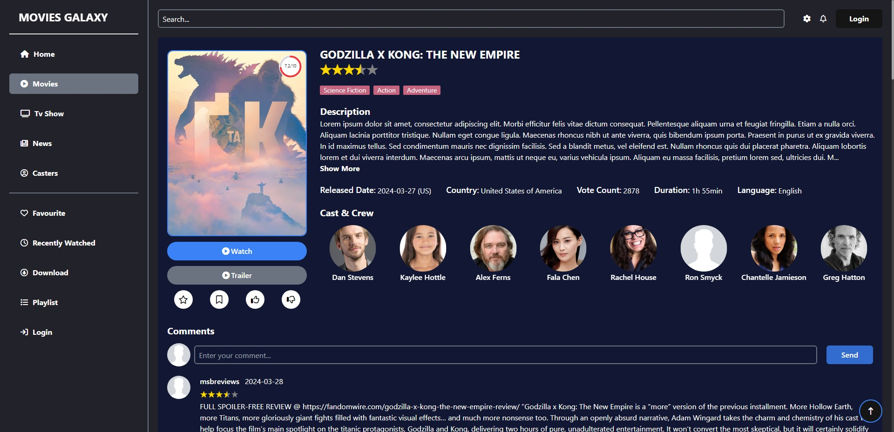
    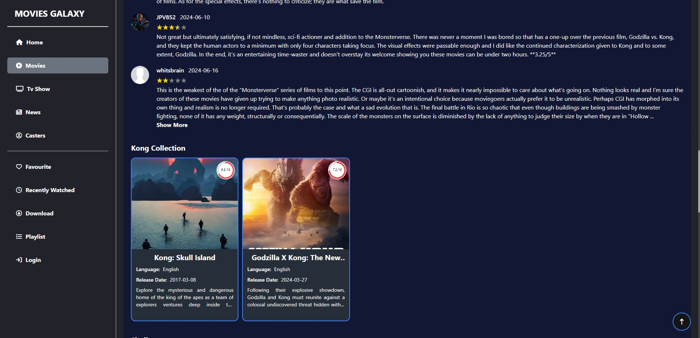
    
</div>
</ol>

<h2>    
    Requirements
</h2>

- Node.js: [Link download](https://nodejs.org/en/download/package-manager/current)
- Visual Code: [Link download](https://code.visualstudio.com/download)

<h2>
How to Install and Set Up the Project Locally
</h2>

Follow these steps to get the project up and running on your local machine:

<h5>
    1. Clone repository
</h5>

```
git clone https://github.com/buitanphat247/Project_Movie_Galaxy_By_React.git
```

<h5>
    2. Navigate into the project directory
</h5>

```
cd Movie_Galaxy
```

<h5>
    3. Install dependencies
</h5>

```
npm install
```

<h5>
    4. Start the development server
</h5>

```
npm start
```

<h5>
    5. Open your browser
</h5>

Navigate to [http://localhost:3000](http://localhost:3000) to view the application.

**Additional Notes**

<p>
    Make sure you have Node.js and npm installed on your machine.
    <br>
    If you encounter any issues during installation or setup, refer to the project's documentation or the repository's issue tracker for assistance.
</p>

<h2>
    API Usage
</h2>

This project utilizes the MovieDB API to fetch movie data and display information within the application. The API provides endpoints for searching movies, retrieving details about specific movies, and fetching images and trailers.

### API Source

The movie data is sourced from [The Movie Database (TMDb)](https://www.themoviedb.org/documentation/api). To use the API, you will need to sign up for an API key, which is required for authentication and access to their endpoints.

### Example Usage

```javascript
// Ví dụ về sử dụng Axios để gọi API từ TMDb và lấy danh sách phim phổ biến
import axios from "axios";

const API_KEY = "your_tmdb_api_key";
const BASE_URL = "https://api.themoviedb.org/3";

const fetchPopularMovies = async () => {
  try {
    const response = await axios.get(`${BASE_URL}/movie/popular`, {
      params: {
        api_key: API_KEY,
      },
    });
    return response.data.results; // Return the list of popular movies
  } catch (error) {
    console.error("Error fetching popular movies:", error);
    return []; // Handle the error accordingly
  }
};

export { fetchPopularMovies };
```

For more details or to contribute, please visit the project repository on [GitHub](https://github.com/buitanphat247/Project_Movie_Galaxy_By_React).

<h2>
    Questions (FAQ) - Movies Galaxy
</h2>
<ol class="ol_faq">
    <li>
      <p>
        What is Movies Galaxy? Movies Galaxy is a website that provides viewing services
        Free online movies with thousands of diverse movies from many genres
        different.
      </p>
    </li>
    <li>
      <p>
        Do I need to register an account to watch movies on Movies Galaxy?
        No, you do not need to register an account to watch movies on Movies
        Galaxy. All movies on the website can be watched immediately
        no need to login.
      </p>
    </li>
    <li>
      <p>
        How to search for a specific movie on Movies Galaxy? You can use it
        Use Movies Galaxy's search feature. First, go to the home page and
        Use the search bar in the top corner of the website. Enter the keyword of the set
        movie you want to search and press Enter to search.
      </p>
    </li>
    <li>
      <p>
        What movie genres does Movies Galaxy support? Movies Galaxy offers the
        Diverse movie genres such as Action, Horror, Comedy, Romance, Adventure
        adventure, Science Fiction, and many other genres.
      </p>
    </li>
    <li>
      <p>
        How do I recommend movies to Movies Galaxy? If you have a suggestion for a set
        movies you would like Movies Galaxy to add to the movie store, please contact
        us via email or social media channels to share your ideas.
      </p>
    </li>
    <li>
      <p>
        How do I contact Movies Galaxy? You can contact us via
        email at <a href="tan270407@gmail.com">tan270407@gmail.com</a> or via social networking sites
        us to send feedback or request support.
      </p>
    </li>
    <li>
      <p>
        Where can I watch movies on Movies Galaxy? You can watch the movie above
        Movies Galaxy from any device with an Internet connection, including computers
        computers, smartphones and tablets.
      </p>
    </li>
    <li>
      <p>
        Does Movies Galaxy have to do anything to ensure movie copyright rights? Movies
        Galaxy always complies with movie copyright regulations and only provides movies
        Films are allowed for public use and distribution.
      </p>
    </li>
    <li>
      <p>
        Can I watch movies on Movies Galaxy at any time?
        Yes, you can visit Movies Galaxy and watch movies at any time
        Whichever is right for you. The site is available 24/7 to ensure you can watch
        movies all the time.
      </p>
    </li>
    <li>
      <p>
        Does Movies Galaxy support subtitles?
         Yes, Movies Galaxy provides subtitle options for various languages ​​to improve the user's movie viewing experience. </p>
    </li>
  </ol>

**Note: this is a one-way operation. Once you `eject`, you can't go back!**

If you aren't satisfied with the build tool and configuration choices, you can `eject` at any time. This command will remove the single build dependency from your project.

Instead, it will copy all the configuration files and the transitive dependencies (webpack, Babel, ESLint, etc) right into your project so you have full control over them. All of the commands except `eject` will still work, but they will point to the copied scripts so you can tweak them. At this point you're on your own.

You don't have to ever use `eject`. The curated feature set is suitable for small and middle deployments, and you shouldn't feel obligated to use this feature. However we understand that this tool wouldn't be useful if you couldn't customize it when you are ready for it.

## Learn More

You can learn more in the [Create React App documentation](https://facebook.github.io/create-react-app/docs/getting-started).

To learn React, check out the [React documentation](https://reactjs.org/).

## Code Splitting

This section has moved here: [https://facebook.github.io/create-react-app/docs/code-splitting](https://facebook.github.io/create-react-app/docs/code-splitting)

## Analyzing the Bundle Size

This section has moved here: [https://facebook.github.io/create-react-app/docs/analyzing-the-bundle-size](https://facebook.github.io/create-react-app/docs/analyzing-the-bundle-size)

## Making a Progressive Web App

This section has moved here: [https://facebook.github.io/create-react-app/docs/making-a-progressive-web-app](https://facebook.github.io/create-react-app/docs/making-a-progressive-web-app)

## Advanced Configuration

This section has moved here: [https://facebook.github.io/create-react-app/docs/advanced-configuration](https://facebook.github.io/create-react-app/docs/advanced-configuration)

## Deployment

This section has moved here: [https://facebook.github.io/create-react-app/docs/deployment](https://facebook.github.io/create-react-app/docs/deployment)

## `npm run build` fails to minify

This section has moved here: [https://facebook.github.io/create-react-app/docs/troubleshooting#npm-run-build-fails-to-minify](https://facebook.github.io/create-react-app/docs/troubleshooting#npm-run-build-fails-to-minify)

---

<h1>
    Thanks For Watching 
</h1>
